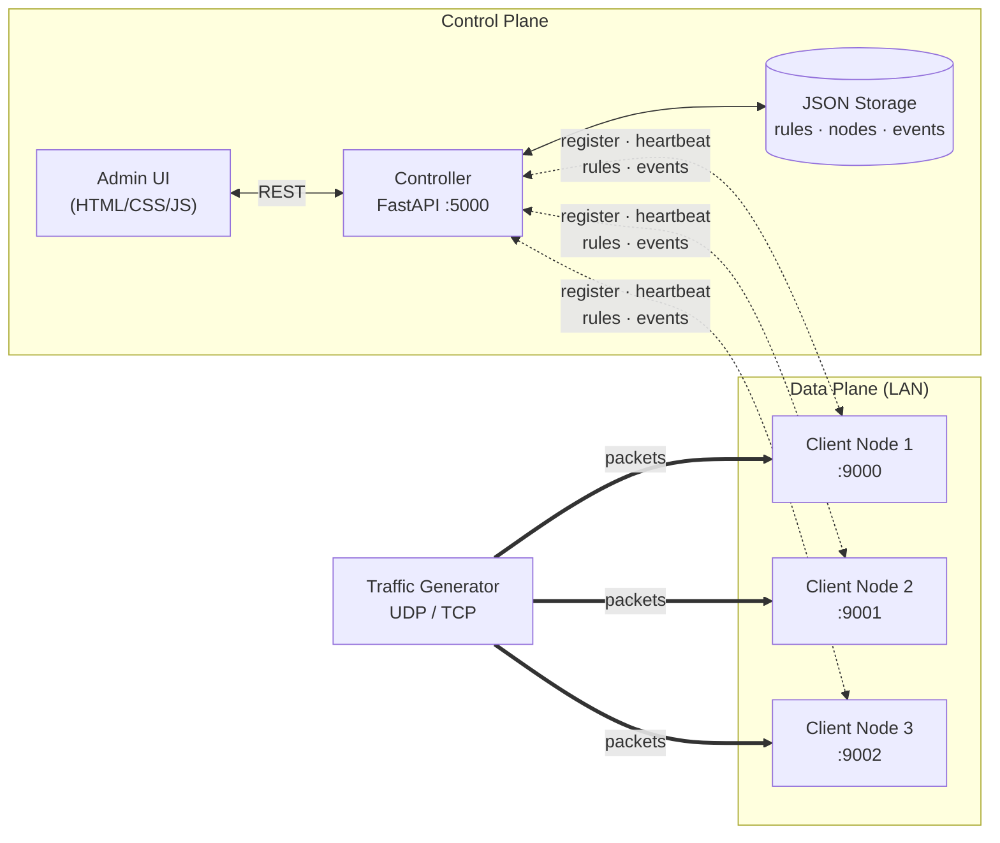
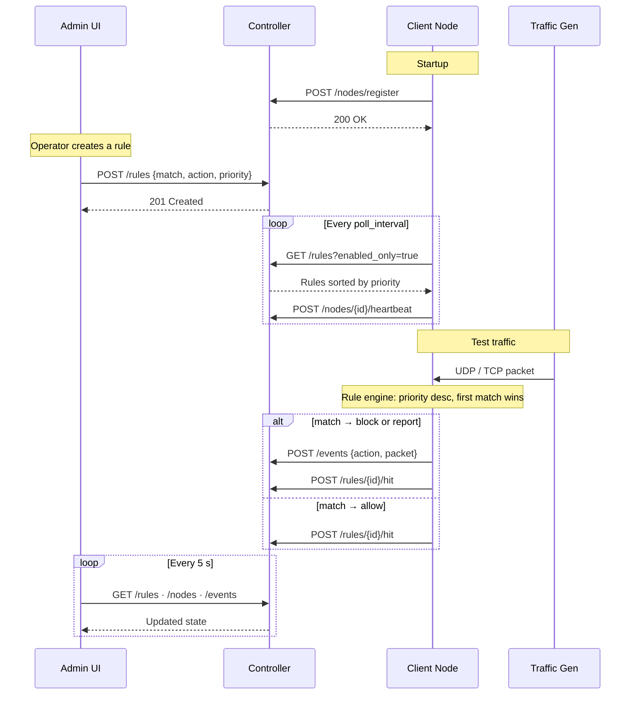

# SDN Firewall

Programmable LAN network with firewall capabilities, built on the SDN paradigm. A centralized controller stores flow rules and distributes them to replicable client nodes, which evaluate live UDP/TCP traffic and **permit**, **block**, or **report** it.

## Architecture

The system separates the **control plane** (decisions, policy storage) from the **data plane** (traffic evaluation), following the SDN paradigm. The controller is the single source of truth; clients are stateless workers that pull rules and apply them locally.



### Message flow



### Components

| Component | Role | Language |
|---|---|---|
| **Controller** (`server/`) | Stores rules, distributes them, receives events, registers nodes | Python · FastAPI |
| **Client** (`client/`) | Listens for traffic, evaluates against rules, reports decisions | Python · stdlib + `requests` |
| **Traffic Generator** (`traffic_gen/`) | Sends configurable UDP/TCP traffic to test rules | Python · stdlib |
| **Admin UI** (`interface/`) | Rule CRUD, live tables, dashboard, topology graph | HTML · CSS · JS |

## Structure

```
sdn-firewall/
├── server/          # Controller (FastAPI) — control plane
├── client/          # Replicable node (Python) — data plane
├── traffic_gen/     # UDP/TCP traffic generator
├── interface/       # Admin UI (HTML/CSS/JS)
├── data/            # Runtime JSON storage (auto-created, gitignored)
├── README.md        # This file — overview & spec compliance
├── SERVER.md        # Controller setup & API reference
├── CLIENT.md        # Client deployment & rule evaluation
└── GENERATOR.md     # Traffic generator usage
```

## Quick start

```powershell
# from sdn-firewall/
python -m venv .venv
.venv\Scripts\Activate.ps1
pip install -r server/requirements.txt -r client/requirements.txt
```

A minimal end-to-end run:

1. Start the **controller** on the main machine — see [SERVER.md](SERVER.md).
2. Start one or more **client nodes** — see [CLIENT.md](CLIENT.md).
3. Send **test traffic** and watch the Event Log in the UI — see [GENERATOR.md](GENERATOR.md).

The `data/` directory is created automatically on first run — no manual setup needed.

## Documentation

| Guide | Covers |
|---|---|
| [SERVER.md](SERVER.md) | Controller setup, running, REST API reference, admin UI, recommended default-deny posture |
| [CLIENT.md](CLIENT.md) | Client deployment, `config.json`, replicability, rule evaluation, how actions are applied |
| [GENERATOR.md](GENERATOR.md) | Traffic generator usage, CLI flags, examples, the self-reported metadata header |

## Spec compliance

Mapping of each requirement from *Proyecto final – Instrucciones* to its implementation.

### Required components

| Spec requirement | Location |
|---|---|
| Controller: register clients | `server/main.py` → `POST /nodes/register` |
| Controller: list of active nodes (id, IP, status, last comm) | `server/main.py` → `GET /nodes`; `Node` model in `server/models.py` |
| Controller: node lifecycle management | Stale detection background task + `DELETE /nodes/{id}` + `DELETE /nodes?status=inactive` |
| Controller: store and distribute rules | `server/main.py` → `/rules` endpoints + `server/storage.py` |
| Controller: receive events/alerts from clients | `server/main.py` → `POST /events` |
| Controller: logs, timestamps, counters | ISO 8601 timestamps on every model + `RuleStats` + JSON persistence |
| Client: register with controller | `client/client.py` → `register()` |
| Client: fetch/receive active rules | `client/client.py` → `_poll_rules()` |
| Client: evaluate traffic against rules | `client/rule_engine.py` → `evaluate()` |
| Client: apply allow / block / report | `client/client.py` → `_handle()`, `_handle_tcp_conn()` |
| Client: send evidence to controller | `client/client.py` → `_report_event()`, `_record_hit()` |
| Client: replicable, config independent of code | `client/config.json` (only file that changes per node) |
| Traffic gen: configurable UDP | `traffic_gen/generator.py` `--protocol UDP` |
| Traffic gen: configurable TCP | `traffic_gen/generator.py` `--protocol TCP` |
| Traffic gen: change IP/port/count/interval/message | CLI flags `--ip --port --count --interval --message` |
| Interface: match fields, action, priority | `interface/index.html` rule form |
| Interface: rule table with counters | Flow Table tab + hit/byte columns |
| Interface: policy interpretation | Per-rule natural-language interpretation in the flow table |
| Interface: sync with server | `interface/app.js` `pollAll()` every 5 s |

### Rule fields

| Spec field | Model field |
|---|---|
| IP src / dst | `match.src_ip`, `match.dst_ip` (CIDR supported) |
| Protocol (TCP, UDP min) | `match.protocol` (TCP / UDP) |
| Port src / dst | `match.src_port`, `match.dst_port` |
| Priority | `FlowRule.priority` (0–65535) |
| *Recommended:* ingress port | `match.in_port` |
| *Recommended:* MAC src / dst | `match.src_mac`, `match.dst_mac` |
| *Recommended:* EthType | `match.eth_type` |
| *Recommended:* VLAN + VLAN priority | `match.vlan_id`, `match.vlan_priority` |
| *Recommended:* ToS | `match.tos` |

How each field is actually enforced (observed vs. self-reported vs. unavailable) is documented in **[CLIENT.md](CLIENT.md#match-field-enforcement)**.

### Required actions

| Action | Implementation |
|---|---|
| Allow / forward | `action = "allow"` → packet processed normally |
| Block / drop | `action = "block"` → packet discarded, event reported |
| Report to controller | `action = "report"` → packet passed, event reported |

### Firewall behaviors

| Spec behavior | Implementation |
|---|---|
| Allow when matches authorized policy | Rule engine returns `allow`, client processes |
| Block when matches denial policy | Rule engine returns `block`, client discards (TCP: closes; UDP: silent) |
| Report sensitive/suspicious events | `report` action + `log_allowed` flag for audit trails |
| Counters per rule | `RuleStats` (packet count, byte count, last match) |
| Deny by default | Recommended catch-all rule — see [SERVER.md](SERVER.md#recommended-default-deny-posture) |

### Restrictions

| Restriction | How it's met |
|---|---|
| 1 controller + 3–4 clients on LAN | Architecture supports N clients; tested with 3 |
| Works over WiFi or Ethernet | Pure IP/socket — link layer agnostic |
| Client replicable with minimal config | Only `config.json` changes (node_id, server_url, port) |
| Rules follow HTML reference flow-table model | Match fields + action + priority + counters mirror the reference |

## Test suite

Run on a LAN with the controller, at least one client, and the traffic generator. T1–T5 are the spec scenarios; T6–T12 are extra coverage.

| # | Goal | Rule | Command |
|---|---|---|---|
| T1 | Allow UDP to authorized port | `proto=UDP, dst_port=9000, allow, pri=100` | `python generator.py --ip <client> --port 9000 --protocol UDP` |
| T2 | Block UDP to a port | `proto=UDP, dst_port=9001, block, pri=100` | `python generator.py --ip <client> --port 9001 --protocol UDP` |
| T3 | Block by source IP | `src_ip=<gen-ip>, block, pri=200` | `python generator.py --ip <client> --port 9000 --protocol UDP` |
| T4 | Report (alert) | `proto=UDP, dst_port=9000, report, pri=50` | `python generator.py --ip <client> --port 9000 --protocol UDP` |
| T5 | Priority conflict | A: `dst_port=9000, block, pri=300`; B: `dst_port=9000, allow, pri=100` | Send to 9000; A wins; disable A → B wins |
| T6 | TCP block | `proto=TCP, dst_port=9000, block, pri=100` | `python generator.py --ip <client> --port 9000 --protocol TCP` |
| T7 | CIDR subnet block | `src_ip=192.168.1.0/24, block, pri=150` | From an in-subnet machine |
| T8 | Multi-client distribution | Any rule | Send to two different clients |
| T9 | Live toggle | Toggle an `allow` rule via UI mid-traffic | Disable it → traffic stops passing within one poll |
| T10 | Live rule add | Add a `block` rule while UDP is flowing | Verify packets blocked within poll interval |
| T11 | Block by MAC (self-reported) | `src_mac=<generator MAC>, block, pri=200` | `python generator.py --ip <client> --port 9000 --protocol UDP` (MAC is printed on startup) |
| T12 | VLAN match (self-reported) | `vlan_id=20, report, pri=100` | `python generator.py --ip <client> --port 9000 --protocol UDP --vlan 20` |
