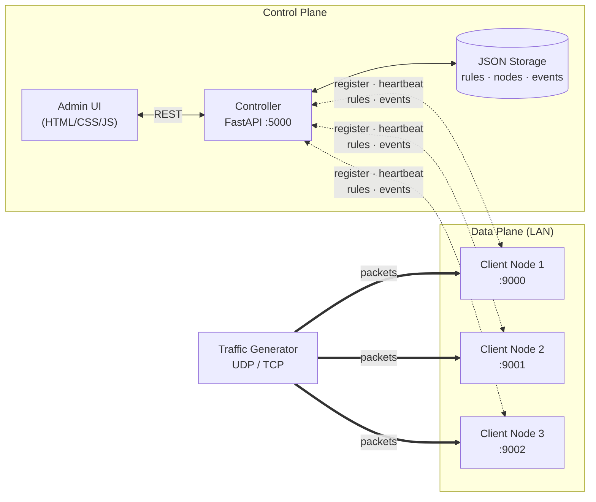
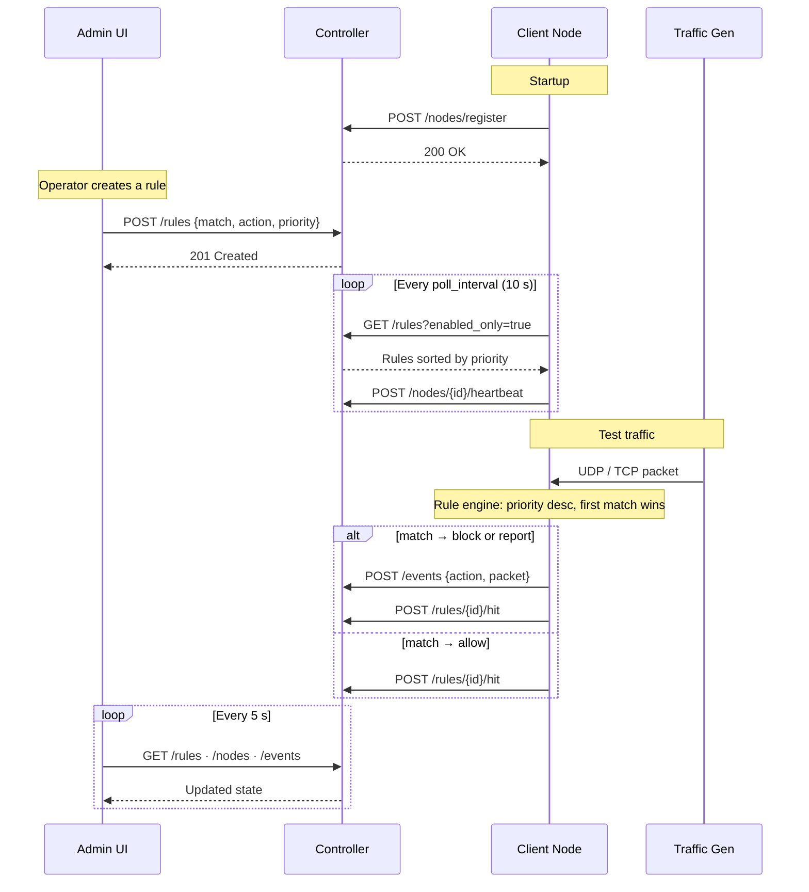

# SDN Firewall

Programable LAN network with firewall capabilities, built on the SDN paradigm.

## Architecture

The system separates the **control plane** (decisions, policy storage) from the **data plane** (traffic evaluation), following the SDN paradigm. The controller is a single source of truth; clients are stateless workers that pull rules and apply them locally.



### Message flow



### Components

| Component | Role | Language |
|---|---|---|
| **Controller** (`server/`) | Stores rules, distributes them, receives events, registers nodes | Python · FastAPI |
| **Client** (`client/`) | Listens for traffic, evaluates against rules, reports decisions | Python · stdlib |
| **Traffic Generator** (`traffic_gen/`) | Sends configurable UDP/TCP traffic to test rules | Python · stdlib |
| **Admin UI** (`interface/`) | Rule CRUD, live tables, dashboard, topology graph | HTML · CSS · JS |

## Structure

```
sdn-firewall/
├── server/          # Controller (FastAPI) — control plane
├── client/          # Replicable node (Python) — data plane
├── traffic_gen/     # UDP/TCP traffic generator
├── interface/       # Admin UI (HTML/CSS/JS)
└── data/            # Runtime JSON storage (gitignored)
```

## Setup

```bash
# From sdn-firewall/
python -m venv .venv
.venv\Scripts\activate        # Windows
pip install -r server/requirements.txt
```

Initialize data files (required on first run, do once per machine):
```bash
echo [] > data/rules.json
echo [] > data/nodes.json
echo [] > data/events.json
```

## Running

**Server** (run on the main machine):
```bash
cd server
uvicorn main:app --host 0.0.0.0 --port 5000
```
- API docs: `http://localhost:5000/docs`
- Admin UI: `http://<server-ip>:5000/ui`

**Client** (run on each node — edit `config.json` only):
```bash
cd client
python client.py
```

`config.json` fields:
| Field | Description |
|---|---|
| `node_id` | Unique name for this node |
| `server_url` | Controller IP, e.g. `http://192.168.1.100:5000` |
| `listen_port` | Port to receive traffic on |
| `poll_interval` | Seconds between rule syncs |
| `log_allowed` | `true` to log allowed traffic as events |

**Traffic generator:**
```bash
cd traffic_gen
python generator.py --ip <client-ip> --port 9000 --protocol UDP --count 10
python generator.py --help   # all options
```

## Spec compliance

Mapping of each requirement from *Proyecto final – Instrucciones* to its implementation.

### Required components

| Spec requirement | Location |
|---|---|
| Controller: register clients | `server/main.py` → `POST /nodes/register` |
| Controller: list of active nodes (id, IP, status, last comm) | `server/main.py` → `GET /nodes`; `Node` model in `server/models.py` |
| Controller: node lifecycle management | Stale detection background task + `DELETE /nodes/{id}` + `DELETE /nodes?status=inactive` |
| Controller: store and distribute rules | `server/main.py` → `/rules` endpoints + `server/storage.py` |
| Controller: receive events/alerts from clients | `server/main.py` → `POST /events` |
| Controller: logs, timestamps, counters | ISO 8601 timestamps on every model + `RuleStats` + JSON persistence |
| Client: register with controller | `client/client.py` → `register()` |
| Client: fetch/receive active rules | `client/client.py` → `_poll_rules()` |
| Client: evaluate traffic against rules | `client/rule_engine.py` → `evaluate()` |
| Client: apply allow / block / report | `client/client.py` → `_handle()`, `_handle_tcp_conn()` |
| Client: send evidence to controller | `client/client.py` → `_report_event()`, `_record_hit()` |
| Client: replicable, config independent of code | `client/config.json` (only file that changes per node) |
| Traffic gen: configurable UDP | `traffic_gen/generator.py` `--protocol UDP` |
| Traffic gen: configurable TCP | `traffic_gen/generator.py` `--protocol TCP` |
| Traffic gen: change IP/port/count/interval/message | CLI flags `--ip --port --count --interval --message` |
| Interface: match fields, action, priority | `interface/index.html` rule form |
| Interface: rule table with counters | Flow Table tab + hit/byte columns |
| Interface: policy interpretation | "Policy Interpretation" panel |
| Interface: sync with server | `interface/app.js` `pollAll()` every 5 s |

### Rule fields

| Spec field | Model field |
|---|---|
| IP src / dst | `match.src_ip`, `match.dst_ip` (CIDR supported) |
| Protocol (TCP, UDP min) | `match.protocol` (TCP / UDP / ICMP) |
| Port src / dst | `match.src_port`, `match.dst_port` |
| Priority | `FlowRule.priority` (0–65535) |
| *Recommended:* ingress port | `match.in_port` |
| *Recommended:* MAC src / dst | `match.src_mac`, `match.dst_mac` |
| *Recommended:* EthType | `match.eth_type` |
| *Recommended:* VLAN + VLAN priority | `match.vlan_id`, `match.vlan_priority` |
| *Recommended:* ToS | `match.tos` |

### Required actions

| Action | Implementation |
|---|---|
| Allow / forward | `action = "allow"` → packet processed normally |
| Block / drop | `action = "block"` → packet discarded, event reported |
| Report to controller | `action = "report"` → packet passed, event reported |

### Firewall behaviors

| Spec behavior | Implementation |
|---|---|
| Allow when matches authorized policy | Rule engine returns `allow`, client processes |
| Block when matches denial policy | Rule engine returns `block`, client discards (TCP: closes; UDP: silent) |
| Report sensitive/suspicious events | `report` action + `log_allowed` flag for audit trails |
| Counters per rule | `RuleStats` (packet count, byte count, last match) |

### Restrictions

| Restriction | How it's met |
|---|---|
| 1 controller + 3–4 clients on LAN | Architecture supports N clients; tested with 3 |
| Works over WiFi or Ethernet | Pure IP/socket — link layer agnostic |
| Client replicable with minimal config | Only `config.json` changes (node_id, server_url, port) |
| Rules follow HTML reference flow-table model | Match fields + action + priority + counters mirror the reference |

### Test scenarios

See the [Test Suite](#test-suite) below — T1–T5 are the spec scenarios, T6–T10 are extra coverage.

## Test Suite

Run on a LAN with the controller, at least one client, and the traffic generator.

| # | Goal | Rule | Command |
|---|---|---|---|
| T1 | Allow UDP to authorized port | `proto=UDP, dst_port=9000, allow, pri=100` | `python generator.py --ip <client> --port 9000 --protocol UDP` |
| T2 | Block UDP to a port | `proto=UDP, dst_port=9001, block, pri=100` | `python generator.py --ip <client> --port 9001 --protocol UDP` |
| T3 | Block by source IP | `src_ip=<gen-ip>, block, pri=200` | `python generator.py --ip <client> --port 9000 --protocol UDP` |
| T4 | Report (alert) | `proto=UDP, dst_port=9000, report, pri=50` | `python generator.py --ip <client> --port 9000 --protocol UDP` |
| T5 | Priority conflict | A: `dst_port=9000, block, pri=300`; B: `dst_port=9000, allow, pri=100` | Send to 9000; A wins; disable A → B wins |
| T6 | TCP block | `proto=TCP, dst_port=9000, block, pri=100` | `python generator.py --ip <client> --port 9000 --protocol TCP` |
| T7 | CIDR subnet block | `src_ip=192.168.1.0/24, block, pri=150` | From an in-subnet machine |
| T8 | Multi-client distribution | Any rule | Send to two different clients |
| T9 | Live toggle | Disable a rule via UI mid-traffic | Verify packets pass next poll |
| T10 | Live rule add | Add a block rule while UDP is flowing | Verify packets blocked within poll interval |

## Flow rules

Each rule has: match fields (IP, protocol, port — blank = wildcard `*`), an action, and a priority. Higher priority wins on conflict.

| Action | Effect |
|---|---|
| `allow` | Packet accepted |
| `block` | Packet dropped, event sent to server |
| `report` | Packet accepted, event sent to server |
